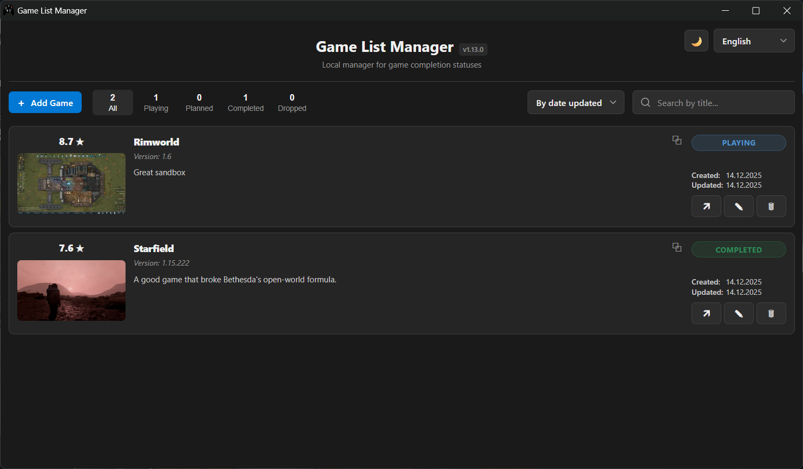

# 🎮 GameList

**GameList** — офлайн веб-приложение для учёта пройденных игр. Отслеживайте статусы, ставьте оценки, добавляйте скриншоты и отзывы.



## ✨ Возможности

- **📊 Учёт статусов**: Планирую, Играю, Завершено, Брошено
- **⭐ Оценки и отзывы**: Оценивай игры по 10-балльной шкале с текстовыми заметками
- **🖼️ Скриншоты**: Добавляй скриншот к каждой игре
- **🔍 Поиск и фильтры**: Быстрый поиск по названию и фильтрация по статусам
- **📱 Офлайн-работа**: Все данные хранятся локально, не требует подключения к интернету
- **🎨 Темы**: Тёмная и светлая тема
- **🌍 Локализация**: Русский и английский интерфейс

## 📦 Запуск и сборка

### 💾 Портируемая версия (Portable)

Скачайте последний [релиз](https://github.com/lergvot/GameList/releases), разархивируйте архив и запустите исполняемый файл.

### 🔧 Для опытных пользователей

```bash
# Клонируйте репозиторий
git clone https://github.com/lergvot/GameList.git

cd GameList

# Установите зависимости
pip install -r requirements.txt

# Запустите приложение
python main.py

# Сборка исполняемого файла (опционально)
python build.py
```

## 🛠️ Технологии

- **Frontend:** HTML/CSS/JS (без фреймворков)
- **Backend:** Python + Eel
- **База данных:** SQLite
- **Особенности:** Офлайн-работа, темы, локализация

### Зависимости Python

- eel
- Pillow

## 📁 Структура проекта

```text
GameList/
├── web/
│   ├── index.html          # Основная страница
│   ├── style.css           # Стили
│   ├── js/
│   │   ├── api.js          # Работа с данными
│   │   ├── app.js          # Основная логика
│   │   ├── localisation.js # Управление локализацией
│   │   ├── theme.js        # Управление темами
│   │   ├── tooltips.js     # Кастомные тултипы
│   │   └── ui.js           # Динамический интерфейс
│   └── translations/       # Файлы переводов
│       ├── ru.js
│       └── en.js
├── build.py                # Скрипт сборки приложения
├── config.py               # Конфигурации
├── main.py                 # Основной скрипт
├── requirements.txt        # Зависимости Python
└── README.md               # Документация
```
