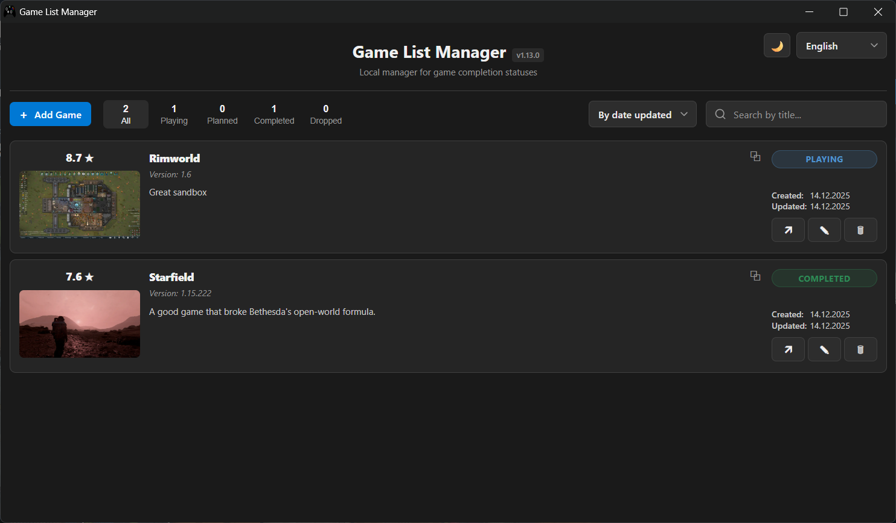

# 🎮 GameList


**GameList** — офлайн веб-приложение для учёта пройденных игр. Отслеживай статусы, ставь оценки, добавляй скриншоты и отзывы.



## ✨ Возможности

- **📊 Учёт статусов**: Планирую, Играю, Завершено, Брошено
- **⭐ Оценки и отзывы**: Оценка игры по 10-балльной шкале и написание отзыва
- **🖼️ Скриншоты**: Добавление скриншота к каждой игре
- **🔍 Поиск и фильтры**: Быстрый поиск по названию и фильтрация по статусам
- **📱 Офлайн-работа**: Все данные хранятся локально, не требует подключения к интернету
- **🎨 Темы**: Тёмная и светлая тема
- **🌍 Локализация**: Русский и английский интерфейс

### Требования

- Google Chrome
- Python 3.12+ (для запуска из исходников или сборки)

## 📦 Запуск и сборка

### 💾 Портативная версия (Portable)

Скачай последний [релиз](https://github.com/lergvot/GameList/releases), извлеки файлы и запусти.

### 🔧 Для опытных пользователей

```shell
# Клонирование репозитория
git clone https://github.com/lergvot/GameList.git

cd GameList

# Установка зависимостей (рекомендуется в venv)
pip install -r requirements.txt

# Запуск приложения
python main.py

# Сборка исполняемого файла (для Windows)
python build.py
```

## 🛠️ Технологии

- **Frontend:** HTML/CSS/JS (без фреймворков)
- **Backend:** Python + Eel
- **База данных:** SQLite

## 📁 Структура проекта

```text
GameList/
├── app/
│   ├── api.py              # Работа с данными
│   ├── database.py         # Работа с БД
│   ├── image_utils.py      # Обработка изображений
│   ├── logger.py           # Работа с логами
│   ├── updater.py          # Проверка обновлений приложения
├── web/
│   ├── index.html          # Основная страница
│   ├── style.css           # Стили
│   ├── js/
│   │   ├── api.js          # Работа с данными
│   │   ├── app.js          # Основная логика
│   │   ├── localisation.js # Управление локализацией
│   │   ├── theme.js        # Управление темами
│   │   ├── tooltips.js     # Кастомные тултипы
│   │   └── ui.js           # Динамический интерфейс
│   └── translations/       # Файлы переводов
│       ├── ru.js
│       └── en.js
├── build.py                # Скрипт сборки приложения
├── config.py               # Конфигурации
├── main.py                 # Основной скрипт
├── requirements.txt        # Зависимости Python
└── README.md               # Описание
```

## 📜 Лицензия

Проект распространяется под лицензией **GNU GPL v3.0** — это означает:

- ✅ Вы можете свободно использовать, изменять и распространять приложение
- ✅ При распространении изменённых версий вы обязаны открыть исходный код
- ❌ Нет никаких гарантий — приложение поставляется «как есть»

Полный текст лицензии — в файле [LICENSE](LICENSE).
